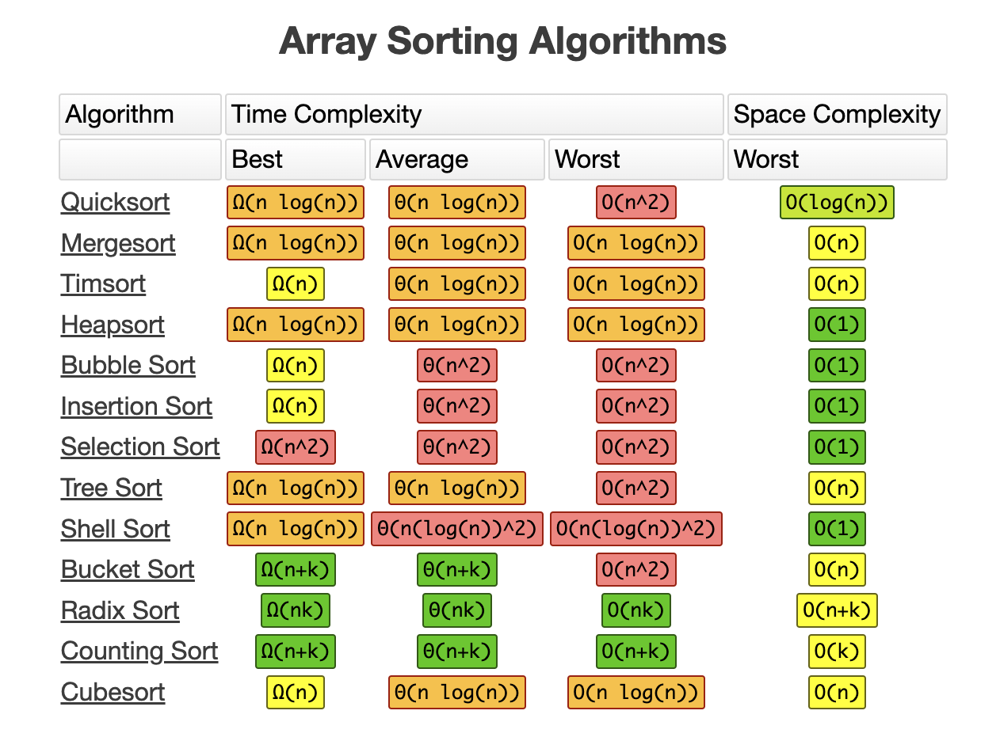

## Array Sorting Algorithms



More details: [Bigo Cheat Sheet](https://www.bigocheatsheet.com/)

## Bubble Sort


```swift
func bubbleSort(_ array: [Int]) -> [Int] {
    var sortedArray = array
    for i in stride(from: sortedArray.count - 1, to: 0, by: -1) {
        for j in 0..<i {
            let temp = sortedArray[j]
            if sortedArray[j] > sortedArray[j + 1] {
                sortedArray[j] = sortedArray[j + 1]
                sortedArray[j + 1] = temp
            }
        }
    }
    return sortedArray
}
```

## Selection Sort


```swift
func selectionSort(_ array: [Int]) -> [Int] {
    var sortedArray = array
    for i in 0..<sortedArray.count {
        var min = sortedArray[i]
        var cur = i
        for j in i..<sortedArray.count {
            if sortedArray[cur] > sortedArray[j] {
                cur = j
            }
        }
        let temp = sortedArray[i]
        sortedArray[i] = sortedArray[cur]
        sortedArray[cur] = temp
    }
    return sortedArray
}
```

## Insertion Sort


```swift
func insertionSort(_ array: [Int]) -> [Int] {
    var sortedArray = array
    for index in 1..<sortedArray.count {
        var cur = index - 1
        let temp = sortedArray[index]
        // right -> left
        while cur >= 0 && temp < sortedArray[cur] {
            sortedArray[cur + 1] = sortedArray[cur]
            cur -= 1
        }
        sortedArray[cur + 1] = temp
    }
    return sortedArray
}
```

## Shell Sort


